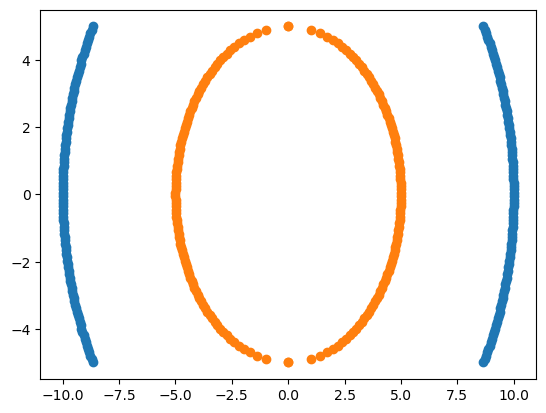
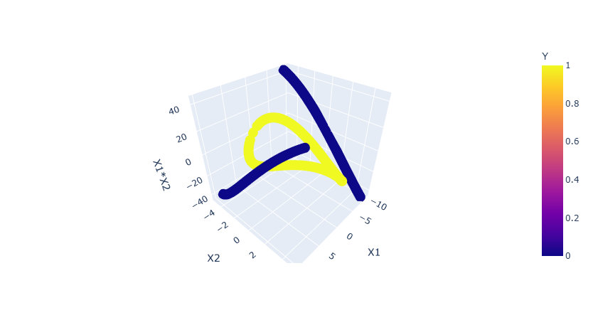
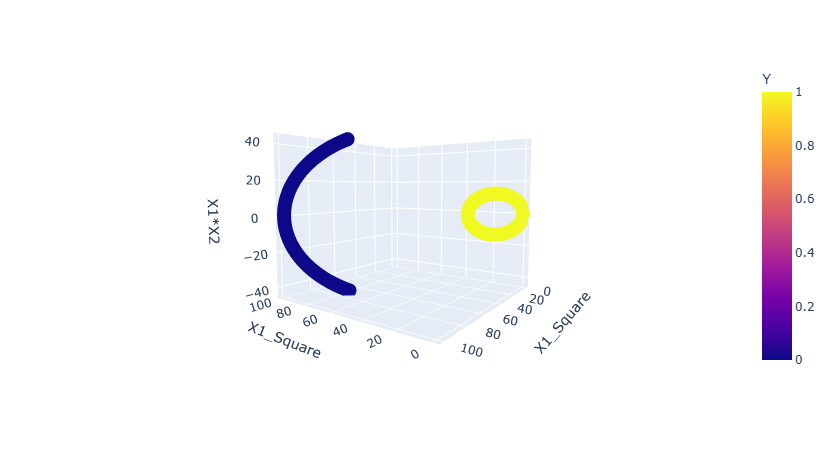
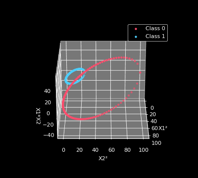

# 🔮 Kernel Trick Magic

**Why straight lines fail and kernels win.** A hands-on notebook that builds two concentric circles (impossible to split with a line) and shows how SVM kernels solve it by lifting the data into higher dimensions.

  

---

## 🎯 The problem

Two classes, one ring inside another. No straight line in 2D can separate them.

<p align="center">
  
</p>

## 🚀 The idea: add a dimension

Create new features from the originals (`X1²`, `X2²`, `X1*X2`) and plot the data in 3D. The classes start pulling apart.

<p align="center">
  
</p>

With the squared features, the two rings sit in clearly different regions of space, so a flat plane can separate them.

<p align="center">
  
</p>

<p align="center">
  
</p>

> The notebook uses interactive Plotly 3D plots (rotate and zoom). GitHub can't render those, so the images and GIF above are static stand-ins. Run the notebook locally for the interactive ones.

## 📊 Results

Accuracy on a 25% test split (`random_state=0`):

| Features used | Kernel | Accuracy |
|---------------|--------|----------|
| Raw `X1, X2` | Linear | 0.44 |
| `X1, X2, X1², X2², X1*X2` | Linear | 1.00 |
| `X1, X2, X1², X2², X1*X2` | Poly | 1.00 |
| `X1, X2, X1², X2², X1*X2` | RBF | 1.00 |
| `X1, X2, X1², X2², X1*X2` | Sigmoid | 1.00 |

A linear kernel on the raw 2D data does no better than guessing (0.44). After adding the polynomial features by hand (the kernel trick done manually), even a plain linear kernel reaches 1.00, and so do all the other kernels.

## 📂 What's inside

- Generating the two-class circle dataset with NumPy
- Visualising in 2D (Matplotlib) and 3D (Plotly)
- Manual polynomial feature expansion
- Training `SVC` with linear, poly, RBF and sigmoid kernels

## ⚙️ Setup

```bash
git clone https://github.com/Aditya-hope/kernel-trick-magic.git
cd kernel-trick-magic
python -m venv venv
source venv/bin/activate    # Windows: venv\Scripts\activate
pip install -r requirements.txt
jupyter notebook SVM_Kernels_Implementation.ipynb
```

## 🛠️ Tech

Python, NumPy, Pandas, Matplotlib, Plotly, scikit-learn

## 📄 License

MIT